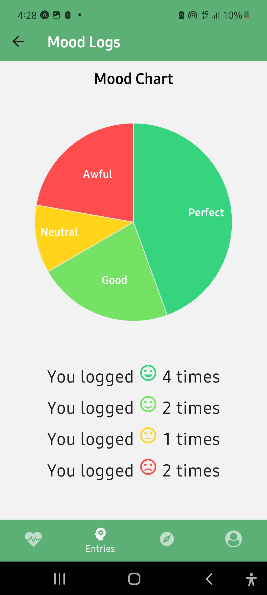

<div align="center">

> Hello world! This is the project’s summary that describes the project plain and simple, limited to the space available.

**[PROJECT PHILOSOPHY](#philosophy) • [WIREFRAMES](#wireframes) • [TECH STACK](#stack) • [IMPLEMENTATION](#implementation) • [HOW TO RUN?](#installation)**

</div>

<br><br>


> PSYLEB is a Lebanese platform aimed to connect mental health providers (psychologists, psychiatrist, life coaches…) with their patients/clients. It was developed in hopes of easing the search for a mental health provider and enable the latter in return to better track their patients reports.


>

<!-- > There are 5 daily tasks that the Well app asks you to complete each day: record 3 gratitudes, write a journal entry, perform 3 acts of kindness, exercise for 20 minutes, and meditate for 15 minutes. -->

### User Stories
#### &nbsp; &nbsp; &nbsp; &nbsp; &nbsp;  As a client: 

- I want to be able to log my daily mood, diaries and sleeping time. 
- I want to look for nearby providers on a map and access their profile with ease.

#### &nbsp; &nbsp; &nbsp; &nbsp; &nbsp;  As a provider: 
- I want to check my reviews
- I want to keep track of my clients logs in order to have better insight into their daily life.  


<br><br>


> This design was planned before on paper, then moved to Figma app for the fine details.
> Note that i didn't use any styling library or theme, all from scratch and using pure css modules

| Home                                                                                | Logs                                                                               |
| -------------------------------------------------------------------------------------- | ----------------------------------------------------------------------------------------- |
|  |   |

| Explore                                                                               | User Profile                                                                               |
| ---------------------------------------------------------------------------------------------- | --------------------------------------------------------------------------------------------- |
|  |  |

<br><br>


Here's a brief high-level overview of the tech stack PSYLEB uses:

- This project was developed using [React Native](https://reactnative.dev/). React Native is a cross-platform hybrid app development platform which allows us to use a single codebase for apps on mobile, desktop, and the web. The design of the app adheres to the material design guidelines.
- [MySQL](https://reactnative.dev/) was used for storage (database),which is an open-source relational database management system.
- [Laravel](https://laravel.com/) was used as a backend framework to build APIs and query the database using 'Eloquent' ORM. 


<br><br>


> Using the above mentioned tech stacks and the wireframes built with figma from the user sotries we have, the implementation of the app is shown as below, these are screenshots from the real app

| Home                                                                                | Logs                                                                               |
| -------------------------------------------------------------------------------------- | ----------------------------------------------------------------------------------------- |
|  |   |

| Explore                                                                               | User Profile                                                                               |
| ---------------------------------------------------------------------------------------------- | --------------------------------------------------------------------------------------------- |
|  |  |

Mood Chart                                                                               | Edit Profile                                                                               |
| ---------------------------------------------------------------------------------------------- | --------------------------------------------------------------------------------------------- |
|  |  


<br><br>


> This is an example of how you may give instructions on setting up your project locally.
> To get a local copy up and running follow these simple example steps.

### Prerequisites

This is an example of how to list things you need to use the software and how to install them.

- npm
  ```sh
   npm install -g yarn
  ```

### Installation

_Below is an example of how you can instruct your audience on installing and setting up your app. This template doesn't rely on any external dependencies or services._

1. Install expo cli on your machine using the following command:
   ```sh
    yarn add global expo-cli
   ```

2. Clone the repo
   ```sh
   git clone https://github.com/Khalifeh11/PSYLEB.git
   ```
3. Install yarn packages
   ```sh
   yarn install
   ```
<!-- 4. Enter your API in `config.js`
   ```js
   const API_KEY = "ENTER YOUR API";
   ``` -->